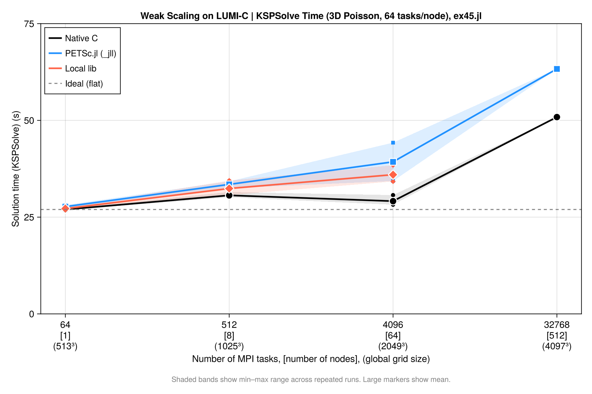

# Running on HPC Systems

PETSc.jl can be used on HPC clusters in two main configurations: using precompiled binaries via MPITrampoline, or by pointing to a locally installed PETSc build.

## 1. Use precompiled binaries via MPITrampoline

The main reason that it is challenging to run applications on HPC systems is that MPI is implemented in a different way by different vendors. This will change in the future as there is now the MPI ABI (application Binary Interface) and our precompiled PETSc binaries are already compatible with that.

Yet, until all MPI implementations fully support this, we recommend using [MPITrampoline](https://github.com/eschnett/MPITrampoline) instead, which is a MPI wrapper layer that lets MPI-linked binaries be redirected to any system MPI at runtime. The `PETSc_jll` binaries distributed with PETSc.jl are built against MPITrampoline, which means they can be used on clusters by simply configuring `MPI.jl` to use the system MPI.
Doing this requires you to compile a small code on the HPC system that is linked versus the local MPI implementation.

Here step-by-step instructions (for Linux, as that is what essentially all HPC systems use):

#### 1.1 Install MPIwrapper 

* Download [MPIwrapper](https://github.com/eschnett/MPIwrapper): 
```bash
git clone https://github.com/eschnett/MPIwrapper.git 
cd MPIwrapper
```

* Install it after making sure that `mpiexec` points to the one you want (you may have to load some modules, depending on your system):
```bash
cmake -S . -B build -DMPIEXEC_EXECUTABLE=/full/path/to/mpiexec -DCMAKE_BUILD_TYPE=RelWithDebInfo -DCMAKE_INSTALL_PREFIX=$HOME/mpiwrapper
cmake --build build
cmake --install build
```
> [!IMPORTANT]  
> You need to specify the full path to `mpiexec` (or equivalent, such as `srun` or `mpirun`, depending oin your system) and not just the name. If you don't know that, you can determine this with
> `which mpiexec`
 
At this stage, `MPIwrapper` is installed in `$HOME/mpiwrapper`

#### 1.2 Set the correct wrappers
Next, you need to specify these environmental variables:
```
export MPITRAMPOLINE_LIB=$HOME/mpiwrapper/lib64/libmpiwrapper.so
export MPITRAMPOLINE_MPIEXEC=$HOME/MPIwrapper/mpiwrapper/bin/mpiwrapperexec 
```
Depending on the system it may be called `lib` instead of `lib64` (check!).


#### 1.3 Install the `MPI` and `MPIPreferences` packages:
Install packages the usual way:
```julia
julia
julia> ]
pkg>add MPI, MPIPreferences
```

Set the preference to use `MPItrampoline`:
```julia
julia> using MPIPreferences; MPIPreferences.use_jll_binary("MPItrampoline_jll")
┌ Info: MPIPreferences unchanged
└   binary = "MPItrampoline_jll"
```

Load `MPI` and verify it is the correct one:
```julia
julia> using MPI
julia> MPI.Get_library_version()
"MPIwrapper 2.10.3, using MPIABI 2.9.0, wrapping:\nOpen MPI v4.1.4, package: Open MPI boris@Pluton Distribution, ident: 4.1.4, repo rev: v4.1.4, May 26, 2022"
```
After this, restart julia (this only needs to be done once, next time all is fine).

#### 1.4 Test `MPI`:

If you want you can run a test case with:
```julia
julia> using MPI
julia> mpiexec(cmd -> run(`$cmd -n 3 echo hello world`));
hello world
hello world
hello world
```

#### 1.5 Install and use `PETSc.jl`:
Now install `PETSc.jl`:
```julia
julia> using MPI,PETSc
```
At this stage you can use PETSc.jl as normal — no changes to your script needed:
```julia
using PETSc, MPI
petsclib = PETSc.getlib(; PetscScalar = Float64, PetscInt = Int64)
PETSc.initialize(petsclib)
# ...
```

1. Launch via the cluster's MPI:
```bash
mpiexec -n 128 julia --project myScript.jl
```
This is the easiest path for most clusters and requires no custom PETSc compilation.

## 2. Use a locally installed PETSc build

If you need a PETSc build with specific options (external packages, GPU support, custom BLAS, etc.), you can point `PETSc.jl` directly to your local installation.
The local PETSc must be compiled as a **shared library** (`--with-shared-libraries=1`) and linked against the **same MPI** that `MPI.jl` is configured to use (i.e. the one that you should use on your HPC machine).

#### 2.1 Link `PETSc` to the local library  

Use `set_library!` to configure the path once — it is stored in `LocalPreferences.toml` and no environment variables are needed afterwards:

```julia
using PETSc
PETSc.set_library!(
    "/path/to/custom/libpetsc.so";
    PetscScalar = Float64,
    PetscInt    = Int64,
)
# Restart Julia — PETSc_jll is not loaded and your library is used automatically.
```

#### 2.2 Link `MPI.jl` to the local mpi
You *must* use the same MPI implementation as the one versus which you compiled PETSc (otherwise you'll get heaps of problems).

Check with:
```julia
julia> using MPI

julia> MPI.Get_library_version()
```


### 3. Typical HPC job script

A typical slurm submissions script to run PETSc code using `MPITrampoline` binaries can look like:

```bash
#!/bin/bash
#SBATCH --nodes=8
#SBATCH --ntasks-per-node=128


export MPITRAMPOLINE_LIB=/users/kausbori/mpiwrapper/lib64/libmpiwrapper.so
export JULIA_CPU_TARGET="generic"

srun julia --project ex45.jl \
  -N 257 \
  -ksp_type cg \
  -pc_type mg \
  -pc_mg_levels 5 \
  -mg_levels_ksp_type chebyshev \
  -mg_levels_pc_type sor \
  -ksp_rtol 1e-8 \
  -ksp_view \
  -pc_mg_log \
  -log_view
```

#### Precompile code on compute nodes
On some machines, it can be useful to precompile `PETSc.jl` on a single core rather than having many processors trying to do the same thing simultaneously.

This is an example on how this can be done by getting access on an interactive node using slurm. Note that julia was installed in the home directory using `juliaup`.
```bash
salloc --nodes=1 --ntasks=1 --time=00:30:00 \
    --partition=standard --account=your_project_number

# Once on the compute node:
module --force purge
module load CrayEnv
module load craype
module load gcc-native/13.2
module load cray-mpich/8.1.32

export HOME=/users/kausbori
export JULIA_DEPOT_PATH=/users/kausbori/.julia
export MPITRAMPOLINE_LIB=/users/kausbori/mpiwrapper/lib64/libmpiwrapper.so
export JULIA_CPU_TARGET="generic"

JULIA=/users/kausbori/.julia/juliaup/julia-1.12.6+0.x64.linux.gnu/bin/julia

# Clear stale cache
rm -rf /users/kausbori/.julia/compiled/v1.12/PETSc/
rm -rf /users/kausbori/.julia/compiled/v1.12/PETSc_jll/
rm -rf /users/kausbori/.julia/compiled/v1.12/MPI/

# Precompile
$JULIA --project=/users/kausbori/PETSc_jl_scalability \
    -e 'using PETSc; println("OK")'
```

---

## Performance and Weak Scalability

This section summarises weak scalability results for a 3D Laplacian benchmark ([`ex45.jl`](https://github.com/JuliaParallel/PETSc.jl/blob/main/examples/ex45.jl)) using a CG solver with geometric multigrid preconditioning (`-pc_type mg`). The problem size is scaled proportionally with the number of MPI ranks so that the work per rank stays constant.

We have performed these simulations on LUMI-C (Finnland) and provide job submission scripts (`submit_scaling.sh`, `job.sh`), along with a parsing file that collects and summarizes the results (`parse_scaling.jl`). 
All files are uploaded under [PETSc.jl/examples/scalability_tests](PETSc.jl/examples/scalability_tests), and can be started with
```bash
$ ./submit_scaling.sh 512 1025 1025 1025 6 16
```
which will start a $1025 \times 1025 \times 1015$ simulation on 512 cores, with 6 multigrid levels and the coarse grid solver being solved on 16 cores.

We consider 3 cases:
- Using `PETSc.jl` with MPITrampoline linked to the local MPI ("PETSc.jl"). This is generally the easiest setup
- Using `PETSc.jl` linked to our locally build PETSc version ("local lib")
- Using a C-compiled version of `ex45_julia.c`  ("native")

#### Results
Here the collected results (all simulations, except the largest ones, where done 3 times; I only show the fastest ones here). 

| JobID | Ntasks | MG | NC | Grid | Backend | SolveTime (s) | KSPSolve (s) | TotGFlops | GFlops/s | KSP | L2 error | Max error | Residual | Converged |
|-------|--------|----|----|------|---------|--------------|-------------|-----------|----------|-----|----------|-----------|----------|-----------|
| 17684772 | 64 | 5 | 16 | 513³ | PETSc.jl | 50.800 | 27.108 | 335.60 | 6.00 | 9 | 4.4372e-06 | 1.2557e-05 | 3.5610e-05 | ✅ |
| 17769825 | 64 | 5 | 16 | 513³ | local lib | 51.032 | 27.006 | 335.60 | 6.00 | 9 | 4.4372e-06 | 1.2557e-05 | 3.5610e-05 | ✅ |
| 17767475 | 64 | 5 | 16 | 513³ | native | 38.770 | 26.917 | 337.90 | 8.50 | 9 | 4.4372e-06 | 1.2557e-05 | 3.5610e-05 | ✅ |
| 17724458 | 512 | 6 | 16 | 1025³ | PETSc.jl | 61.715 | 32.482 | 2878.00 | 37.52 | 10 | 1.1093e-06 | 3.1236e-06 | 9.6257e-05 | ✅ |
| 17769827 | 512 | 6 | 16 | 1025³ | local lib | 58.254 | 32.033 | 2878.00 | 40.54 | 10 | 1.1093e-06 | 3.1236e-06 | 9.6257e-05 | ✅ |
| 17767644 | 512 | 6 | 16 | 1025³ | native | 42.700 | 30.122 | 2896.00 | 65.64 | 10 | 1.1093e-06 | 3.1236e-06 | 9.6257e-05 | ✅ |
| 17768041 | 512 | 6 | 16 | 1025³ | native | 42.924 | 30.307 | 2896.00 | 65.34 | 10 | 1.1093e-06 | 3.1236e-06 | 9.6257e-05 | ✅ |
| 17658195 | 4096 | 7 | 16 | 2049³ | PETSc.jl | 72.949 | 34.332 | 21390.00 | 258.00 | 9 | 2.7738e-07 | 7.8741e-07 | 1.9254e-04 | ✅ |
| 17769830 | 4096 | 7 | 16 | 2049³ | local lib | 68.095 | 34.220 | 21390.00 | 270.00 | 9 | 2.7738e-07 | 7.8741e-07 | 1.9254e-04 | ✅ |
| 17767610 | 4096 | 7 | 16 | 2049³ | native | 41.345 | 28.214 | 21540.00 | 506.10 | 9 | 2.7738e-07 | 7.8741e-07 | 1.9254e-04 | ✅ |
| 17726872 | 32768 | 8 | 16 | 4097³ | PETSc.jl | 142.540 | 63.300 | 171000.00 | 746.60 | 9 | 6.9301e-08 | 1.9765e-07 | 6.6391e-04 | ✅ |
| 17767541 | 32768 | 8 | 16 | 4097³ | native | 69.282 | 50.858 | 172200.00 | 2386.00 | 9 | 6.9301e-08 | 1.9765e-07 | 6.6391e-04 | ✅ |

---
In this table `KSPSolve` indicates the time spend in the solver (taken from the log) and `SolveTime` the time for the full solution.

Below, we break this for each of the cases:

#### a) PETSc.jl with precompiled `PETSc_jll` binaries

the results of using PETSc.jl with precompiled `jll` libraries are:

| Ntasks | Grid | DOFs/core | KSPSolve (s) | SolveTime (s) | Efficiency | Converged |
|--------|------|-----------|-------------|--------------|------------|-----------|
| 64 | 513³ | 2,109,464 | 27.916 | 55.843 | 100.0% | ✅ |
| 64 | 513³ | 2,109,464 | 27.108 | 50.800 | 103.0% | ✅ |
| 64 | 513³ | 2,109,464 | 28.121 | 56.352 | 99.3% | ✅ |
| 512 | 1025³ | 2,103,302 | 33.670 | 66.789 | 82.9% | ✅ |
| 512 | 1025³ | 2,103,302 | 32.482 | 61.715 | 85.9% | ✅ |
| 512 | 1025³ | 2,103,302 | 34.236 | 65.473 | 81.5% | ✅ |
| 4096 | 2049³ | 2,100,226 | 34.332 | 72.949 | 81.3% | ✅ |
| 4096 | 2049³ | 2,100,226 | 44.244 | 79.557 | 63.1% | ✅ |
| 32768 | 4097³ | 2,098,688 | 63.300 | 142.540 | 44.1% | ✅ |

Please note that in the way we run this on LUMI-C, the 64 core case is on a single node and does not have inter-node communication. Despite this, weak scalability is pretty good (one could also argue to use the 512 core case as reference as this includes communication, in which case it would even be better).
There is some variability in the timing when repeating the same run (a few %).

#### b) PETSc.jl linked against a local PETSc build (system MPI)

| Ntasks | Grid | DOFs/core | KSPSolve (s) | SolveTime (s) | Efficiency | Converged |
|--------|------|-----------|-------------|--------------|------------|-----------|
| 64 | 513³ | 2,109,464 | 27.065 | 51.123 | 100.0% | ✅ |
| 64 | 513³ | 2,109,464 | 27.006 | 51.032 | 100.2% | ✅ |
| 64 | 513³ | 2,109,464 | 27.551 | 56.452 | 98.2% | ✅ |
| 512 | 1025³ | 2,103,302 | 34.456 | 61.041 | 78.5% | ✅ |
| 512 | 1025³ | 2,103,302 | 32.033 | 58.254 | 84.5% | ✅ |
| 512 | 1025³ | 2,103,302 | 30.708 | 61.971 | 88.1% | ✅ |
| 4096 | 2049³ | 2,100,226 | 38.414 | 69.384 | 70.5% | ✅ |
| 4096 | 2049³ | 2,100,226 | 35.292 | 68.905 | 76.7% | ✅ |
| 4096 | 2049³ | 2,100,226 | 34.220 | 68.095 | 79.1% | ✅ |

#### c) Native C build (`ex45_julia.c`)

The equivalent PETSc C example compiled natively, serving as the baseline.


| Ntasks | Grid | DOFs/core | KSPSolve (s) | SolveTime (s) | Efficiency | Converged |
|--------|------|-----------|-------------|--------------|------------|-----------|
| 64 | 513³ | 2,109,464 | 26.917 | 38.770 | 100.0% | ✅ |
| 64 | 513³ | 2,109,464 | 27.155 | 39.011 | 99.1% | ✅ |
| 64 | 513³ | 2,109,464 | 26.854 | 39.065 | 100.2% | ✅ |
| 512 | 1025³ | 2,103,302 | 31.492 | 44.062 | 85.5% | ✅ |
| 512 | 1025³ | 2,103,302 | 30.122 | 42.700 | 89.4% | ✅ |
| 512 | 1025³ | 2,103,302 | 30.607 | 43.331 | 87.9% | ✅ |
| 512 | 1025³ | 2,103,302 | 30.307 | 42.924 | 88.8% | ✅ |
| 4096 | 2049³ | 2,100,226 | 30.694 | 46.659 | 87.7% | ✅ |
| 4096 | 2049³ | 2,100,226 | 28.214 | 41.345 | 95.4% | ✅ |
| 4096 | 2049³ | 2,100,226 | 28.498 | 42.759 | 94.5% | ✅ |
| 32768 | 4097³ | 2,098,688 | 50.858 | 69.282 | 52.9% | ✅ |


#### d) Backend Comparison 

If we compare the case on 4096 cores with a 2049³ grid, for 3D Poisson, 64 nodes × 64 tasks/node, MG levels = 7, coarse ranks = 16 we get:

| Metric | native C | PETSc.jl (`_jll`) | local lib |
|--------|----------|-------------------|-----------|
| **Runs** | 3 | 2 | 3 |
| **SolveTime mean (s)** | 43.6 | 76.3 | 68.8 |
| **SolveTime range (s)** | 41.3–46.7 | 72.9–79.6 | 68.1–69.4 |
| **KSPSolve mean (s)** | 29.1 | 39.3 | 35.9 |
| **KSPSolve range (s)** | 28.2–30.7 | 34.3–44.2 | 34.2–38.4 |
| **KSP iterations** | 9 | 9 | 9 |
| **L2 error** | 2.7738e-07 | 2.7738e-07 | 2.7738e-07 |
| **Converged** | ✅ | ✅ | ✅ |

The relative performance is thus:

| Backend | SolveTime overhead | KSPSolve overhead |
|---------|--------------------|-------------------|
| native C | — (reference) | — (reference) |
| PETSc.jl (best run) | +21.5% | +1.6% |
| PETSc.jl (worst run) | +32.5% | +30.9% |
| local lib | +56.9% | +50.8% |

From this we can conclude:
- **Numerical results are identical** across all backends — same iterations, same L2/Max error.
- **KSPSolve gap vs native** is ~6s for local lib and ~10s for `_jll` — much of this is MG setup overhead inside the solver
- **SolveTime gap vs native** (~25s for local lib, ~32s for `_jll`) includes Julia setup: mesh construction, matrix assembly, MG hierarchy setup
- **local lib** is faster than `_jll` at 4096 tasks (35.9s vs 39.3s mean KSPSolve) — likely because it uses the system Cray libsci BLAS directly without MPItrampoline overhead.
- There is a (significant) drop in performance for high core counts. this is likely related to the multigrid setup and coarse grid solvers and not to PETSc.jl as we see a similar behavior for the native compilation as well.

Overall it shows that there is overhead in using the Julia interface to `PETSc.jl` compared to native C-code. 
On the other hand, this is done in a higher level language and can thus seemlessly integrate with the full Julia ecosystem. It should also be kept in mind that the residual routines etc. are all written in julia. 

As a start one can configure `PETSc.jl` to use MPITrampoline, which doesn't require any PETSc installation and should thus work on any machine. For the last bit of performance one can configure a native PETSc installation and use that instead.

#### Weak scalability plot
Results can be summarized in the plot below:
